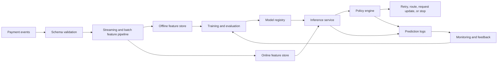

# Payment Failure Intelligence Platform

Architecture blueprint for an ML system that turns payment failure events into explainable operational decisions.

> Status: design phase. This repository currently documents the target architecture, data contract, evaluation plan, and implementation milestones. It does not yet contain a trained model or deployable service.

## Problem

Payment failures are not one problem. A declined transaction can result from insufficient funds, issuer risk controls, incorrect credentials, network issues, duplicate detection, or a temporary processor fault. Each category needs a different response.

The platform is designed to produce three outputs for every failure:

1. A failure category with calibrated confidence
2. A retryability score
3. A recommended action with machine-readable reason codes

The goal is decision support. The model must not bypass issuer, network, compliance, or merchant policy.

## Target architecture



## Event contract

A minimal prediction request should be versioned and independent of any processor-specific payload.

```json
{
  "event_id": "evt_01",
  "event_time": "2026-08-19T10:30:00Z",
  "merchant_id": "merchant_42",
  "payment_method": "card",
  "amount_minor": 249900,
  "currency": "INR",
  "processor": "processor_a",
  "response_code": "insufficient_funds",
  "attempt_number": 1,
  "customer_history": {
    "successful_payments_30d": 4,
    "failed_payments_30d": 1
  }
}
```

A response should include model and policy provenance.

```json
{
  "failure_category": "issuer_decline",
  "retryability_score": 0.82,
  "recommended_action": "retry_later",
  "reason_codes": ["temporary_customer_balance"],
  "model_version": "payment-failure-v1",
  "policy_version": "retry-policy-v1"
}
```

## Modeling approach

Start with transparent baselines before adding model complexity:

- Rules derived from normalized processor response codes
- Multiclass logistic regression or gradient-boosted trees for failure category
- Calibrated binary classifier for retry success
- Time-aware validation to avoid leakage across repeated attempts
- Segment analysis by processor, merchant category, geography, payment method, and amount band

The offline evaluation should report precision, recall, calibration, and expected operational cost. Accuracy alone is not sufficient because false retries and missed recoveries have different consequences.

## Decision policy

The model supplies evidence. A separate policy layer decides the action.

Example actions:

- Retry after a bounded delay
- Route to another processor when contracts permit it
- Ask the customer to update credentials
- Request another payment method
- Stop retrying
- Send the event for manual review

Separating prediction from policy keeps commercial rules, risk limits, and compliance controls auditable.

## MLOps loop

1. Validate and version payment event schemas.
2. Build point-in-time correct training data.
3. Train reproducible baselines.
4. Compare candidate models against a rule-only control.
5. Register artifacts with data, code, and configuration lineage.
6. Deploy behind a shadow or advisory path.
7. Monitor data quality, drift, calibration, latency, and action outcomes.
8. Feed confirmed outcomes back into evaluation and retraining.

## Proposed service indicators

These are design targets, not measured results:

- Prediction availability and latency
- Invalid event rate
- Feature freshness and missing-value rate
- Score distribution and calibration drift
- Retry recovery rate
- Unnecessary retry rate
- Outcome coverage and label delay
- Performance by processor and merchant segment

## Security and governance

- Tokenize or exclude raw payment credentials.
- Minimize customer identifiers in features and logs.
- Encrypt data in transit and at rest.
- Apply least-privilege access to features, models, and prediction logs.
- Retain model version, policy version, reason codes, and input schema version for every decision.
- Define retention and deletion policies before using real transaction data.

## Implementation plan

- [ ] Add versioned synthetic payment event schemas and fixtures
- [ ] Build validation and normalization modules
- [ ] Create a baseline training and evaluation pipeline
- [ ] Add a FastAPI inference contract
- [ ] Separate model output from retry policy
- [ ] Add unit, integration, and data quality tests
- [ ] Add CI, container packaging, and local observability
- [ ] Add drift and outcome monitoring examples
- [ ] Document a shadow deployment and rollback path

## Non-goals

- Reproducing card network authorization logic
- Storing cardholder credentials
- Automating decisions without policy controls
- Claiming recovery, latency, or accuracy gains before measurement
